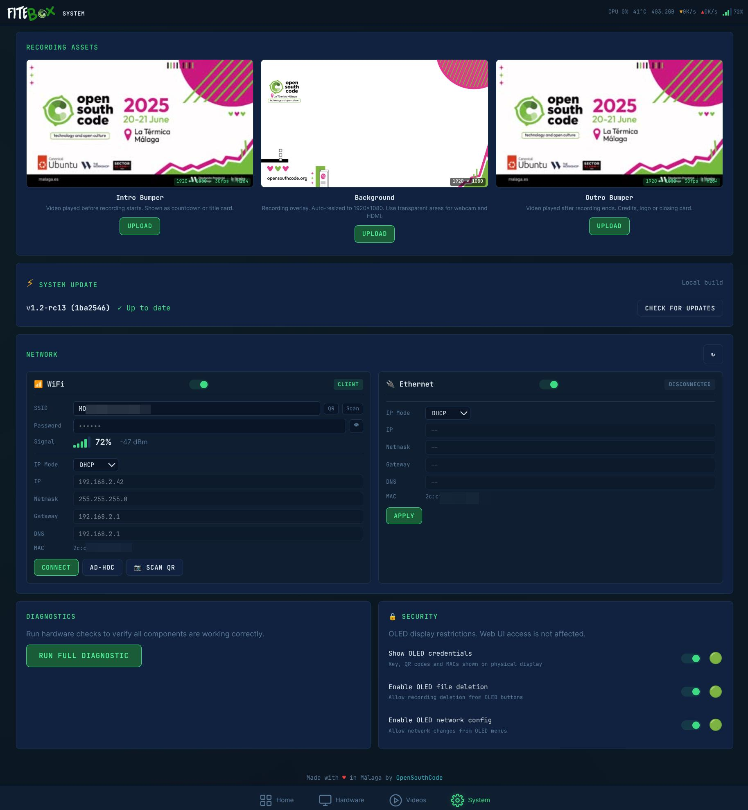
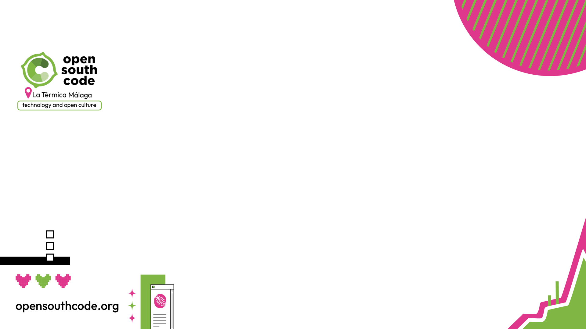
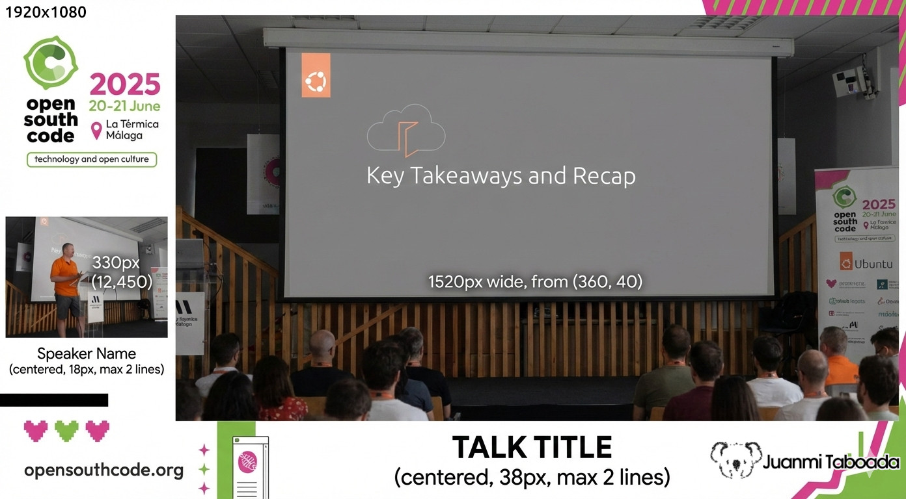
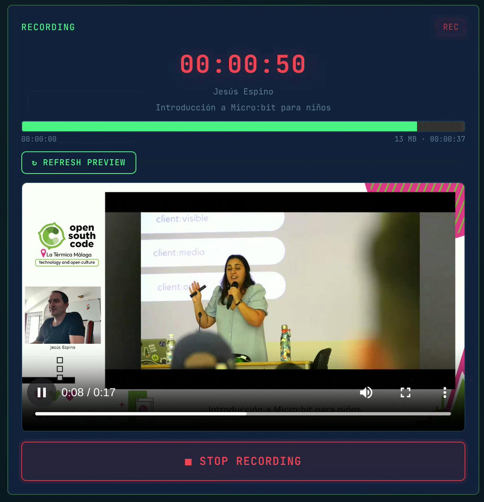
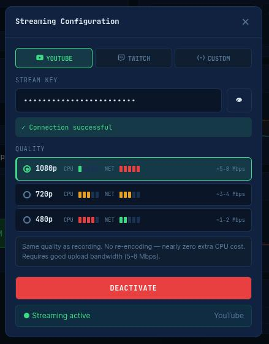

# FITEBOX - Autonomous Conference Recording Appliance

**Record every room. Spend almost nothing. Keep full control.**


**FITEBOX** is an open-source recording box built on a Raspberry Pi 5 that captures conference talks autonomously - composite video (slides + speaker camera), mixed audio, branded overlays, and optional live streaming to YouTube or Twitch - all managed from a tiny OLED screen on the box or a web UI on your phone.

One box per room. A volunteer plugs it in before the first talk, collects recordings at the end of the day. No dedicated operator, no laptop, no cloud dependency.

```
  License .... Apache 2.0
  Version .... 1.0
  Status ..... Production-ready - deploying at OpenSouthCode 2026, Málaga
  Authors .... Juanmi Taboada, David Santos
  Repository . https://github.com/juanmitaboada/fitebox
```

---

## Table of Contents

  0. [Why FITEBOX Exists](#0-why-fitebox-exists)
  1. [What You Get](#1-what-you-get)
  2. [Hardware Requirements](#2-hardware-requirements)
  3. [Software Setup](#3-software-setup)
  4. [First Boot](#4-first-boot)
  5. [Configuration](#5-configuration)
  6. [Recording a Talk](#6-recording-a-talk)
  7. [Live Streaming (Optional)](#7-live-streaming-optional)
  8. [Managing Recordings](#8-managing-recordings)
  10. [Troubleshooting](#10-troubleshooting)
  11. [API Reference](#11-api-reference)
  13. [Credits & Acknowledgments](#13-credits--acknowledgments)
  14. [License](#14-license)

---

## 0. Why FITEBOX Exists

Community tech conferences run on volunteer time and sponsor money. Recording talks is essential - speakers deserve an audience beyond the room, and attendees want to revisit sessions they missed - but professional recording services eat budgets alive. We know because it happened to us.

[OpenSouthCode](https://www.opensouthcode.org) is an annual open-source conference in Málaga, Spain. For years, hiring recording crews consumed up to **40% of the total event budget**. That is money not going to making the event better. For a non-profit association with limited funds, it was unsustainable.

In 2025, **David Santos** and **Juanmi Taboada** decided to fix this. David had the vision for the hardware: a small box based on a Raspberry Pi 5 with an OLED display and physical buttons, capable of autonomously recording a conference room. He designed the hardware architecture, selected the components (the SSD1306 OLED, the GPIO buttons, and the HDMI capture card - the same one used at FOSDEM conferences), and built the first physical prototype, including the 3D-printed enclosure. The hardware foundation of FITEBOX is David's work.

Both of us started developing software independently. We tried FFmpeg first, then OBS. We discovered the hard way that the Raspberry Pi 5 **has no hardware H.264 encoder** (the Pi 4 had `v4l2m2m` - the Pi 5 dropped it entirely). Cheap microphones died after 30 minutes. One of the units was handed to a volunteer with no user interface of any kind. OBS silently misconfigured itself. We lost nearly half the recordings from OpenSouthCode 2025.

But the idea was sound. One small box per room, fully autonomous, costing a fraction of a professional crew. After the event, Juanmi dove back in - this
time armed with patience, better tools, and a determination to make the Pi 5 work. Weeks of development followed: 36 versions of the recording engine, many manual tests on real hardware, and a complete web interface with real-time monitoring. FITEBOX grew from a rough experiment into a professional-grade recording and streaming system.

What you see in this repository is the result. It works. It has been tested.

**If your association, hackerspace, user group, or community conference needs to record talks without blowing the budget - this is for you.**

---

## 1. What You Get

All your videos properly recorded under a layout like this one:


A fully configured FITEBOX gives you:

- **Composite 1080p recording** - presenter's screen (via HDMI capture) as the main image, speaker camera as picture-in-picture, your conference branding as the background frame, and talk title + speaker name as text overlays.
  
- **Automatic audio mixing** - room microphone plus HDMI audio from the presenter's laptop, combined automatically. Plug in one mic or two sources,
  the system adapts.
  
- **Crash-resistant MKV files** - recordings survive power failures. Even if someone trips over the power cable, everything recorded up to that point is
  recoverable.
  
- **Web UI from your phone** - read the 6-character access key from the OLED screen, type it in your phone browser, and you have full control: start/stop recording, monitor health, preview the feed, manage files, configure everything.
  
- **OLED + physical buttons** - no phone needed for basic operation. Navigate  menus, start recording, check status, all from four buttons on the box.
  
- **Live streaming** - optional RTMP streaming to YouTube, Twitch, or any custom server. Branded intro/outro bumpers, single persistent connection,
  zero extra CPU cost for video (audio re-encoded to fix timestamp issues).
  
- **Conference schedule integration** - import your Frab/Pentabarf schedule XML (the standard used by FOSDEM, CCC, OpenSouthCode, and many others) and FITEBOX auto-fills talk titles and speaker names based on room and time.
  
- **Network flexibility** - connect to the venue WiFi, create its own hotspot if there is no WiFi, or use Ethernet. All configurable from the web UI or
  OLED menus.


---

## 2. Hardware Requirements


For a complete guide on assembling the hardware (mounting the NVMe HAT, installing the OLED+buttons module, building the enclosure), see the
companion build guide: [FITEBOX Build Guide - juanmitaboada.com](https://www.juanmitaboada.com/fitebox/)

---

## 3. Software Setup

### 3.1 Flash OS directly to the NVMe SSD

FITEBOX boots directly from the NVMe SSD - no SD card needed for daily use. Connect the NVMe SSD (via a USB adapter or the PCIe HAT on another Pi) and flash **Raspberry Pi OS Lite (64-bit, Debian 12 Bookworm)** to it using [Raspberry Pi Imager](https://www.raspberrypi.com/software/).

During setup in the Imager, enable:

- SSH (so you can work headless)
- Set hostname to something identifiable (e.g., `fitebox-room1`)
- Configure WiFi if needed for initial setup

After flashing, boot the Pi with a temporary SD card to configure PCIe and boot order:

```bash
sudo raspi-config
# → Advanced Options → PCIe Speed → Yes
#   (Enables the PCIe connector and forces Gen 3.0 speeds)

sudo raspi-config
# → Advanced Options → Boot Order → B1: SD Card Boot
#   (Boot from SD card if available, otherwise boot from NVMe)
```

Once configured, remove the SD card and the Pi boots from NVMe. Fast, reliable, and the full 500GB is available for both the OS and recordings.

SSH in and update:

```bash
sudo apt update && sudo apt upgrade -y
```

### 3.2 Enable I2C (for the OLED display)

```bash
sudo raspi-config
# → Interface Options → I2C → Enable
```

Verify the OLED is detected (should show address `0x3c`):

```bash
sudo apt install -y i2c-tools
i2cdetect -y 1
```

The OLED+buttons integrated module connects to the GPIO header with an 8-wire ribbon cable:

| Module Pin | RPi Pin | GPIO |
|---|---|---|
| GND | 39 | Ground |
| VCC | 1 | 3.3V |
| SCL | 5 | GPIO3 (I²C) |
| SDA | 3 | GPIO2 (I²C) |
| K4 (Select) | 35 | GPIO19 |
| K3 (Down) | 38 | GPIO20 |
| K2 (Up) | 36 | GPIO16 |
| K1 (Back) | 37 | GPIO26 |

No external resistors needed - buttons use internal pull-ups via `gpiod`.

### 3.3 Create the recordings directory

Since the OS and recordings live on the same NVMe SSD, just create the recordings directory on the root filesystem:

```bash
sudo mkdir -p /recordings
sudo chown -R 1000:1000 /recordings
```

### 3.4 Clone and Run Setup

```bash
sudo apt-get install git
git clone https://github.com/juanmitaboada/fitebox.git
cd fitebox
sudo ./bin/setup.sh
```

The setup script must be run with `sudo`. It detects the real user (via `$SUDO_USER`) and performs the following:

1. Installs base tools: `curl`, `wget`, `git`, `build-essential`, `v4l-utils`, `alsa-utils`, `bc`, `jq`.
2. Installs Docker and the Compose plugin, adds your user to the `docker` group.
3. Disables PulseAudio and PipeWire system-wide (masks services, disables autospawn) so they do not block ALSA access.
4. Tunes USB buffers (`usbfs_memory_mb=1000`), kernel parameters (`vm.swappiness=10`, dirty ratios, scheduler), and file limits (65536).
5. Enables cgroups for Docker memory management in the boot command line.
6. On Raspberry Pi 5, enables **PCIe Gen 3** for faster SSD throughput and sets boot to console autologin.
7. Installs the FITEBOX Plymouth boot splash theme (if `plymouth/` directory exists).
8. Configures passwordless sudo for `reboot`, `shutdown`, and Plymouth messages.
9. Creates the directory structure (`recordings/`, `log/`, `run/`) with correct ownership.
10. Generates self-signed TLS certificates for HTTPS.
11. Creates the `.env` file with your UID/GID so Docker containers create files owned by your user (not root).

**A reboot is required** after setup to apply kernel and PCIe changes.

### 3.5 Build and Run

```bash
docker compose build
docker compose up -d
```

The container starts in **privileged mode** - it needs direct access to video devices (`/dev/video*`), I2C (`/dev/i2c-*`), GPIO (`/dev/gpiochip*`), ALSA
audio (`/dev/snd/*`), and thermal sensors. This is not optional.

Persistent data is stored in Docker volumes mapped to:

| Volume | Purpose |
|---|---|
| `/recordings` | NVMe SSD - recorded files go here |
| `/fitebox/data` | Background image, bumpers, schedule, config |
| `/fitebox/config` | Authentication master key |
| `/fitebox/run` | Runtime state (sockets, PIDs, health) |
| `/fitebox/log` | Service logs |

### 3.6 Diagnostics

Before your first recording, run the diagnostic tools to verify all hardware is detected:

```bash
# Full system diagnostic - generates a timestamped report in /tmp/
./src/diagnostics.sh

# Audio device detection - classifies all ALSA cards by type
./src/detect_audio.sh

# OLED display detection - scans I2C, runs visual tests
./src/detect_oled.sh

# Button test - verifies GPIO button wiring
python3 src/detect_buttons.py
```

`diagnostics.sh` checks: system info, Raspberry Pi thermal/throttle status, disk space, USB devices, video devices (`v4l2-ctl`), audio devices and levels,
PulseAudio/PipeWire status (should be disabled), I2C/OLED, running FITEBOX processes, Docker containers, health files, recent logs, kernel messages,
network, and CPU/memory. It works both on the host and inside the container.

`detect_audio.sh` classifies ALSA cards into categories (`hdmi_capture`, `webcam`, `sound_card`, `usb_mic`, `generic_usb`) and selects the best
microphone with a priority order: professional sound card > USB mic > generic USB > webcam (fallback). It has a dual mode: run it directly for a full
diagnostic, or source it from another script (like the recording engine) and it exports variables (`VOICE_DEV`, `HDMI_DEV`, `VOICE_CARD_ID`, etc.)
silently. If the HDMI capture and voice mic end up being the same device (which would cause "Device or resource busy"), it automatically disables
HDMI audio and falls back to voice-only mode.

`detect_oled.sh` scans the I2C bus, finds the OLED at `0x3C` or `0x3D`, checks Python dependencies (`luma.oled`, `Pillow`), and runs a series of
visual tests on the display: clear screen, full white, border, text, animation, and a final info screen. It even stops `oled_controller.py` if it is running (the OLED can only be controlled by one process) and restarts it afterwards.

`detect_buttons.py` uses the FiteboxHardware abstraction to test all 4 GPIO buttons in real-time - press a button and see it reported on screen with
PRESS/RELEASE events at 100Hz polling.

---

## 4. First Boot

When the container starts, three services come up in order:

1. **OLED controller** - the display lights up with the FITEBOX logo, then shows the system status.
2. **FITEBOX manager** - starts polling hardware (CPU, temperature, disk, network) and broadcasting status.
3. **Web server** - FastAPI on port 8080, ready for connections.

### Reading the access key

Look at the OLED screen. Cycle through the status views using the Up/Down buttons until you see the **Web Key** screen. It shows a 6-character hex code
like `A1B2C3`.


### Connecting to the web UI

On your phone or laptop, make sure you are on the same network as the FITEBOX (or connect to its hotspot if it created one). Open a browser and go to:

```
https://<FITEBOX_IP>
```

The OLED can also show a QR code with this URL - scan it with your phone camera for instant access.

Enter the 6-character key. You are in.


---

## 5. Configuration

All configuration is done from the **System** page in the web UI. Do this before the event.



### 5.1 Network

From the System page you can:

- Scan for WiFi networks and connect (supports open and WPA)
- Create a FITEBOX hotspot (`FITEBOX_AP`) for direct phone connection
- View Ethernet status
- Set static IP if your venue needs it

For live streaming, Ethernet is recommended. WiFi works fine for the web UI.

### 5.2 Conference Schedule

If your conference uses **Frab/Pentabarf schedule format** (most open-source conferences do), paste the schedule URL and hit Download. Then select the room this FITEBOX is assigned to.

```
Example: https://www.opensouthcode.org/conferences/opensouthcode2025/schedule.xml
```

Once loaded, the dashboard will automatically show the current talk based on time and room. When you start recording, the speaker name and talk title are auto-filled and rendered as text overlays in the recording.

### 5.3 Background Image

Upload a **1920×1080 PNG** that serves as the branded frame for your composite recording. This is the canvas behind the slides and speaker camera. Example:



The composite layout:



### 5.4 Bumpers (Intro/Outro)

Upload optional branded video clips (your conference logo animation, sponsor reel, etc.) that will be prepended and appended to recordings.

The upload workflow:

1. Upload any video format.
2. FITEBOX probes it with ffprobe and shows you the specs.
3. If the format matches (1080p, 30fps, H.264, AAC 48kHz) → instant copy.
4. If it does not match → shows you the differences, you confirm, it re-encodes.
5. A thumbnail preview is extracted.

Bumpers are used in two places: as intro/outro segments during live streaming, and for offline concatenation with finished recordings.

### 5.5 Diagnostics

The System page includes a diagnostics section that checks hardware, audio, video, network, and storage. Run it before the event to catch problems early.

---

## 6. Recording a Talk

### From the web UI

1. Open the **Dashboard**.
2. Verify the current talk is shown (if schedule is loaded).
3. Verify cameras and audio on the **Hardware** page - you can see live MJPEG previews of both cameras and audio level meters, all at zero CPU cost.
4. Go back to Dashboard, hit the big **Start Recording** button.



### From the physical buttons

Navigate the OLED menu to the recording option and press Select. The OLED will show recording status (elapsed time, file size) while it runs.

### What happens under the hood

The recording engine (v36) launches a single long-running FFmpeg process that:

1. Reads three video inputs simultaneously: your background PNG, the HDMI capture card, and the USB webcam.
2. Composites them into the 1920×1080 layout described above.
3. Overlays the speaker name and talk title as text.
4. Mixes audio from all detected sources (room mic + HDMI audio if available).
5. Encodes to H.264 (software, `libx264 -preset ultrafast -crf 28`) and AAC audio.
6. Writes to a **Matroska (.mkv)** container on the SSD.

MKV was chosen deliberately for crash resistance: even if power is cut mid-recording, all data up to that point is recoverable.

Output specs:

```
  Container .. MKV (Matroska)
  Video ...... H.264, Constrained Baseline, 1920x1080, 30fps, CRF 28
  Audio ...... AAC LC, 192 kbps, 48 kHz, stereo
  Bitrate .... ~2.4 Mbps total (~1 GB/hour)
  Storage .... 500GB NVMe ≈ 500 hours of recording
  Filename ... rec_YYYYMMDD_HHMMSS[_Author_Title].mkv
```

### Monitoring a recording

While recording, the dashboard shows:

- **Health histogram** - live FFmpeg stats: fps, bitrate, encoding speed, dropped frames. If speed drops below 1.0x, you have a problem.
- **Recording preview** - a ~15-second clip extracted from the growing MKV file using the "sandwich" technique, playable directly in the browser.
- **CPU and temperature charts** - 10-minute sparkline so you can spot thermal throttling.
- **Disk I/O and remaining time estimate**.

### Stopping

Hit Stop on the dashboard or press the button on the box. FFmpeg receives a clean shutdown signal, finalizes the MKV headers, and the file is ready.

---

## 7. Live Streaming (Optional)



FITEBOX can stream to YouTube, Twitch, or any RTMP server while simultaneously recording locally. This was one of the hardest parts to get right.

### Configuration

On the Dashboard, select a streaming destination (YouTube / Twitch / Custom) and enter your stream key. Hit Start Streaming after the recording is running.

### How it works

The streaming pipeline maintains a **single persistent RTMP connection** and feeds video segments sequentially:

```
  Phase 1 - WAITING ..... polls until recording starts
  Phase 2 - BUFFERING ... waits ~15s for MKV to accumulate data
  Phase 3 - INTRO ....... feeds the intro bumper
  Phase 4 - LIVE ........ feeds the growing MKV file (video: copy, audio: re-encode)
  Phase 5 - DRAINING .... recording stopped, drains to natural EOF
  Phase 6 - OUTRO ....... feeds the outro bumper
  Phase 7 - CLOSING ..... closes RTMP connection cleanly
```

The live phase uses **`-c:v copy`** for video - zero CPU cost. Only the audio is re-encoded to fix timestamp irregularities that would otherwise cause audible clicks on the stream (see Troubleshooting).

Timestamp continuity across phases is maintained with `-output_ts_offset` chaining on each feeder process. Without this, YouTube sees timestamp jumps and kills the stream.

### Why a single RTMP connection?

Multiple connections caused YouTube to interpret each segment as a separate stream. The audience would see "stream ended" and have to rejoin. One persistent TCP session through the entire broadcast solved this.

---

## 8. Managing Recordings

The **Recordings** page in the web UI lets you:

- Browse all recordings with metadata (duration, size, date, speaker, title)
- **Play back in the browser** - MKV files are remuxed to MP4 on-the-fly (zero CPU, just container repackaging)
- Download the original MKV
- **Apply bumpers** - concatenate intro + recording + outro into a single file with automatic A/V sync validation
- Batch delete with confirmation
- View JSON metadata sidecars


---

## 9. Troubleshooting

### HDMI cable triggers insufficient power warning

Some bulky micro HDMI adapters or cables with thick molded connectors draw enough current to trigger the Raspberry Pi 5's under-voltage warning, even with the official power supply. The symptom is the lightning bolt icon and `vcgencmd get_throttled` showing under-voltage events. Use **slim, short micro HDMI cables** without bulky adapters. Before blaming your power supply, try swapping the HDMI cable.

### No video from HDMI capture

Check that the capture card is detected:

```bash
v4l2-ctl --list-devices
```

Look for "Hagibis" or "MS2109" in the output. If it does not appear, try a different USB port. Some USB 3.0 ports have compatibility issues - use USB 2.0.

### No audio

Some USB audio devices ship with capture channels **muted by default**. FITEBOX unmutes them automatically, but if you still have no audio:

```bash
# List ALSA cards
arecord -l

# Check mixer controls (replace 0 with your card number)
amixer -c 0 contents

# Force unmute everything
amixer -c 0 set Capture 100% unmute
amixer -c 0 set Mic 100% unmute
```

Also: **PulseAudio blocks ALSA**. If PulseAudio is running, FFmpeg cannot access audio devices directly. Kill it:

```bash
pulseaudio -k && sleep 1
```

In Docker, either do not install PulseAudio or kill it in the entrypoint.

### Recording has audio clicks (during streaming)

This is the MKV AAC timestamp problem. AAC packets in Matroska have micro-irregularities (on the order of milliseconds) that are inaudible during playback but produce clicks when copied directly to FLV/RTMP.

The fix is to **always re-encode audio for streaming**:

```
-af aresample=async=1000
```

This aggressively corrects timestamp drift greater than ~21ms. The value `async=1` is too gentle and will not fix it. Using `-c:a copy` preserves the
broken timestamps. FITEBOX handles this automatically in the streaming pipeline.

### Encoding speed below 1.0x

The Raspberry Pi 5 runs a single 1080p software encode at roughly 1.0x speed. If encoding speed drops below that, frames are being dropped. Check for:

- **Thermal throttling** - is the CPU temperature above 80°C? Add a fan or heatsink.
- **Disk contention** - is something else writing to the SSD? Preview extraction, downloads, and other disk access should use `nice -n 19 ionice -c 3`.
- **USB bus contention** - two capture devices plus an SSD on the same USB controller can saturate the bus.

### OLED not showing anything

```bash
# Check I2C is enabled
i2cdetect -y 1
# Should show 0x3c
```

If no device is found: check wiring (SDA→Pin 3, SCL→Pin 5, VCC→Pin 1, GND→Pin 39) and make sure I2C is enabled in `raspi-config`.

### USB device order changes between boots

This is normal. USB device enumeration is not deterministic - `/dev/video0` might be the webcam on one boot and the HDMI card on the next.

FITEBOX handles this automatically by detecting devices **by name** (looking for keywords like "Hagibis", "MS2109", "camera") rather than by device number. Do not hardcode `/dev/videoN` in any configuration.

### MKV file corrupted after power loss

MKV is designed to be crash-resistant. In most cases, the file is playable up to the point of interruption. If it needs repair:

```bash
# Install mkvtoolnix
sudo apt install mkvtoolnix

# Repair
mkclean --fix your_recording.mkv repaired.mkv
```

### YouTube stream dies after reconnection

YouTube needs a **1-2 minute cooldown** between stream sessions. If you stop and restart streaming too quickly, YouTube will accept the connection but degrade quality or drop it. Wait at least a minute before restarting.

---

## 10. API Reference

The web server exposes a REST API with HMAC-SHA256 authentication. All requests must include a signature computed as `HMAC(timestamp:body, key)` with a 30-second replay window.

Key endpoints:

| Method | Path | Description |
|---|---|---|
| `POST` | `/api/recording/start` | Start recording (optional: author, title) |
| `POST` | `/api/recording/stop` | Stop recording |
| `POST` | `/api/streaming/start` | Start streaming (destination, key) |
| `POST` | `/api/streaming/stop` | Stop streaming |
| `GET` | `/api/recordings` | List recordings with metadata |
| `GET` | `/api/recordings/<file>/play` | Stream MKV→MP4 for browser playback |
| `GET` | `/api/recordings/<file>/download` | Download original MKV |
| `POST` | `/api/recordings/<file>/bumper` | Apply bumpers to recording |
| `DELETE` | `/api/recordings/<file>` | Delete recording |
| `GET` | `/api/hardware/preview/<device>` | MJPEG preview stream |
| `GET` | `/api/hardware/audio/<device>` | MP3 audio stream |
| `POST` | `/api/network/scan` | Scan WiFi networks |
| `POST` | `/api/network/connect` | Connect to WiFi |
| `POST` | `/api/network/hotspot` | Create WiFi hotspot |
| `POST` | `/api/schedule/download` | Download conference schedule XML |
| `POST` | `/api/system/reboot` | Reboot the Raspberry Pi |
| `POST` | `/api/system/shutdown` | Shut down the Raspberry Pi |
| `WS` | `/ws` | WebSocket - real-time status, metrics history |

The JavaScript client library (`fitebox.js`) handles HMAC signing, WebSocket reconnection, and toast notifications automatically.

---

## 11. Credits & Acknowledgments

**David Santos** - designed the hardware architecture for the first FITEBOX prototype, selected the OLED display and button components, selected the HDMI capture card (the same one used at FOSDEM conferences), built the preliminary OLED controller software, and designed and 3D-printed the first physical enclosure (STL files included in the repository). The hardware foundation of this project exists because of David's work.

**Juanmi Taboada** - software development: recording engine (36 versions), streaming pipeline, web interface, system manager, OLED controller v2+, CPU optimization, setup automation, and all the FFmpeg debugging that led to production stability.

**[OpenSouthCode](https://www.opensouthcode.org)** - the annual open-source conference in Málaga, Spain, where FITEBOX was conceived, developed, and will be deployed in production at the 2026 edition. The need to record every room affordably and reliably is the reason this project exists.

This project was developed with assistance from AI coding tools (Claude by Anthropic, Gemini by Google) as pair-programming partners during the development process.

**Build guide & full story:** [juanmitaboada.com/fitebox](https://www.juanmitaboada.com/fitebox/)

---

## 12. License

```
Copyright 2025-2026 Juanmi Taboada, David Santos

Licensed under the Apache License, Version 2.0 (the "License");
you may not use this file except in compliance with the License.
You may obtain a copy of the License at

    http://www.apache.org/licenses/LICENSE-2.0

Unless required by applicable law or agreed to in writing, software
distributed under the License is distributed on an "AS IS" BASIS,
WITHOUT WARRANTIES OR CONDITIONS OF ANY KIND, either express or implied.
See the License for the specific language governing permissions and
limitations under the License.
```

---

*FITEBOX - because every talk deserves to be recorded, and no community
should go broke doing it.*
