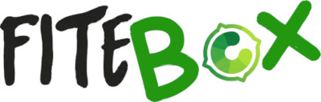
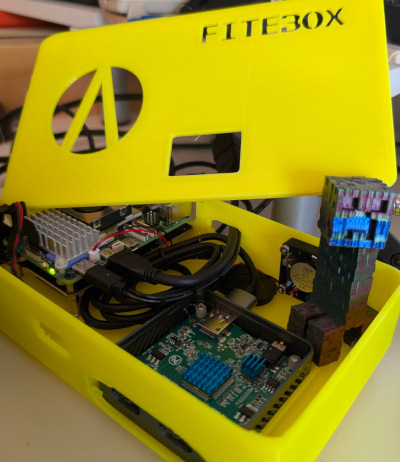
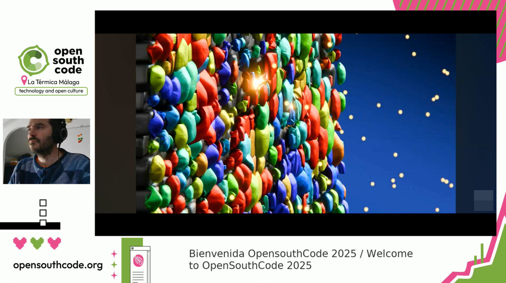
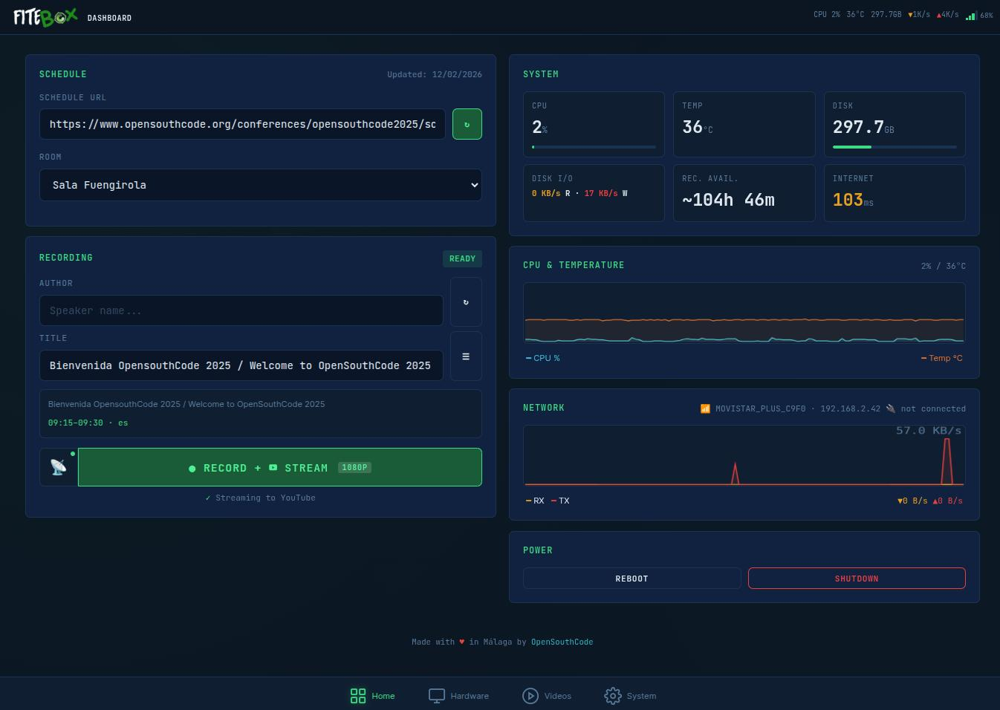
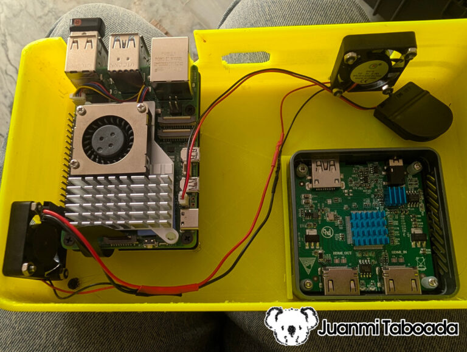
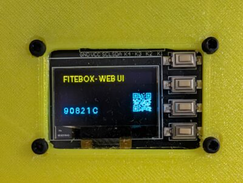
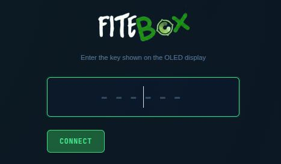

[](https://github.com/juanmitaboada/fitebox/actions/workflows/docker-publish.yml)
[](https://hub.docker.com/r/br0th3r/fitebox)
[](https://hub.docker.com/r/br0th3r/fitebox)
[](https://github.com/juanmitaboada/fitebox/pkgs/container/fitebox)
[](https://www.raspberrypi.com/products/raspberry-pi-5/)
# FITEBOX - Autonomous Conference Recording Appliance

**Record every room. Spend almost nothing. Keep full control.**





**FITEBOX** is an open-source recording box built on a Raspberry Pi 5 that captures conference talks autonomously - composite video (slides + speaker camera), mixed audio, branded overlays, and optional live streaming to YouTube or Twitch - all managed from a tiny OLED screen on the box or a web UI on your phone.

One box per room. A volunteer plugs it in before the first talk, collects recordings at the end of the day. No dedicated operator, no laptop, no cloud dependency.

```
  License .... Apache 2.0
  Version .... 3.0.0
  Status ..... Production-ready - deploying at OpenSouthCode 2026, Málaga
  Authors .... Juanmi Taboada, David Santos
  Repository . https://github.com/juanmitaboada/fitebox
```

---

## Table of Contents

  1. [Why FITEBOX Exists](#1-why-fitebox-exists)
  2. [What You Get](#2-what-you-get)
  3. [Hardware Requirements](#3-hardware-requirements)
  4. [Software Setup](#4-software-setup)
  5. [First Boot](#5-first-boot)
  6. [Documentation](#documentation) - Configuration, Recording, Streaming, Architecture, Troubleshooting, API
  7. [Project](#project) - Changelog, Contributing, Code of Conduct, Security Policy
  8. [Credits & Acknowledgments](#credits--acknowledgments)
  9. [License](#license)

---

## 1. Why FITEBOX Exists

Community tech conferences run on volunteer time and sponsor money. Recording talks is essential - speakers deserve an audience beyond the room, and attendees want to revisit sessions they missed - but professional recording services eat budgets alive. We know because it happened to us.

[OpenSouthCode](https://www.opensouthcode.org) is an annual open-source conference in Málaga, Spain. For years, hiring recording crews consumed up to **40% of the total event budget**. That is money not going to making the event better. For a non-profit association with limited funds, it was unsustainable.

In 2025, **David Santos** and **Juanmi Taboada** decided to fix this. David had the vision for the hardware: a small box based on a Raspberry Pi 5 with an OLED display and physical buttons, capable of autonomously recording a conference room. He designed the hardware architecture, selected the components (the SSD1306 OLED, the GPIO buttons, and the HDMI capture card - the same one used at FOSDEM conferences), and built the first physical prototype, including the 3D-printed enclosure. The hardware foundation of FITEBOX is David's work.

Both of us started developing software independently. We tried FFmpeg first, then OBS. We discovered the hard way that the Raspberry Pi 5 **has no hardware H.264 encoder** (the Pi 4 had `v4l2m2m` - the Pi 5 dropped it entirely). Cheap microphones died after 30 minutes. One of the units was handed to a volunteer with no user interface of any kind. OBS silently misconfigured itself. We lost nearly half the recordings from OpenSouthCode 2025.

But the idea was sound. One small box per room, fully autonomous, costing a fraction of a professional crew. After the event, Juanmi dove back in - this
time armed with patience, better tools, and a determination to make the Pi 5 work. Weeks of development followed: 36 versions of the recording engine, many manual tests on real hardware, and a complete web interface with real-time monitoring. FITEBOX grew from a rough experiment into a professional-grade recording and streaming system.

What you see in this repository is the result. It works. It has been tested.

**If your association, hackerspace, user group, or community conference needs to record talks without blowing the budget - this is for you.**

---

## 2. What You Get

All your videos properly recorded under a layout like this one:



A fully configured FITEBOX gives you:

- **Composite 1080p recording** - presenter's screen (via HDMI capture) as the main image, speaker camera as picture-in-picture, your conference branding as the background frame, and talk title + speaker name as text overlays.

- **Automatic audio mixing** - room microphone plus HDMI audio from the presenter's laptop, combined automatically. Plug in one mic or two sources,
  the system adapts.

- **Crash-resistant MKV files** - recordings survive power failures. Even if someone trips over the power cable, everything recorded up to that point is
  recoverable.

- **Web UI from your phone** - read the 6-character access key from the OLED screen, type it in your phone browser, and you have full control: start/stop recording, monitor health, preview the feed, manage files, configure everything.

- **OLED + physical buttons** - no phone needed for basic operation. Navigate  menus, start recording, check status, all from four buttons on the box.

- **Live streaming** - optional RTMP streaming to YouTube, Twitch, or any custom server. Branded intro/outro bumpers, single persistent connection,
  zero extra CPU cost for video (audio re-encoded to fix timestamp issues).

- **Conference schedule integration** - import your Frab/Pentabarf schedule XML (the standard used by FOSDEM, CCC, OpenSouthCode, and many others) and FITEBOX auto-fills talk titles and speaker names based on room and time.

- **Network flexibility** - connect to the venue WiFi, create its own hotspot if there is no WiFi, or use Ethernet. All configurable from the web UI or
  OLED menus.



---

## 3. Hardware Requirements



For a complete guide on assembling the hardware (mounting the NVMe HAT, installing the OLED+buttons module, building the enclosure), see the
companion build guide: [FITEBOX Build Guide - juanmitaboada.com](https://www.juanmitaboada.com/fitebox/)

---

## 4. Software Setup

### 4.1 Flash OS directly to the NVMe SSD

FITEBOX boots directly from the NVMe SSD - no SD card needed for daily use. Connect the NVMe SSD (via a USB adapter or the PCIe HAT on another Pi) and flash **Raspberry Pi OS Lite (64-bit, Debian 12 Bookworm)** to it using [Raspberry Pi Imager](https://www.raspberrypi.com/software/).

During setup in the Imager, enable:

- SSH (so you can work headless)
- Set hostname to something identifiable (e.g., `fitebox-room1`)
- Configure WiFi if needed for initial setup

After flashing, boot the Pi with a temporary SD card to configure PCIe and boot order:

```bash
sudo raspi-config
# → Advanced Options → PCIe Speed → Yes
#   (Enables the PCIe connector and forces Gen 3.0 speeds)

sudo raspi-config
# → Advanced Options → Boot Order → B1: SD Card Boot
#   (Boot from SD card if available, otherwise boot from NVMe)
```

Once configured, remove the SD card and the Pi boots from NVMe. Fast, reliable, and the full 500GB is available for both the OS and recordings.

SSH in and update:

```bash
sudo apt update && sudo apt upgrade -y
```

### 4.2 Enable I2C (for the OLED display)

```bash
sudo raspi-config
# → Interface Options → I2C → Enable
```

Verify the OLED is detected (should show address `0x3c`):

```bash
sudo apt install -y i2c-tools
i2cdetect -y 1
```

The OLED+buttons integrated module connects to the GPIO header with an 8-wire ribbon cable:

| Module Pin | RPi Pin | GPIO |
|---|---|---|
| GND | 39 | Ground |
| VCC | 1 | 3.3V |
| SCL | 5 | GPIO3 (I²C) |
| SDA | 3 | GPIO2 (I²C) |
| K4 (Select) | 35 | GPIO19 |
| K3 (Down) | 38 | GPIO20 |
| K2 (Up) | 36 | GPIO16 |
| K1 (Back) | 37 | GPIO26 |

No external resistors needed - buttons use internal pull-ups via `gpiod`.

### 4.3 Create the recordings directory

Since the OS and recordings live on the same NVMe SSD, just create the recordings directory on the root filesystem:

```bash
sudo mkdir -p /recordings
sudo chown -R 1000:1000 /recordings
```

### 4.4 Choose your deployment method

FITEBOX can be deployed in two ways:

- **Option A: Quick Deploy** - download a pre-built Docker image. No
  compilation, no cloning the full repository. Recommended for production.
- **Option B: Build from Source** - clone the repository and build the Docker
  image locally. Recommended for development and customization.

Both options require running the host setup script first.

---

### 4.5 Option A: Quick Deploy (pre-built image)

Download the setup script and run it:

```bash
sudo apt-get install -y git curl
git clone --depth 1 https://github.com/juanmitaboada/fitebox.git /tmp/fitebox-setup
cd /tmp/fitebox-setup
sudo ./bin/setup.sh
```

**A reboot is required** after setup ([what setup.sh does](#37-what-setupsh-does)).

After reboot, create a deployment directory:

```bash
mkdir -p ~/fitebox && cd ~/fitebox

# Download production compose file and nginx config
curl -LO https://raw.githubusercontent.com/juanmitaboada/fitebox/main/deploy/docker-compose.yml
curl -LO https://raw.githubusercontent.com/juanmitaboada/fitebox/main/deploy/nginx.conf

# Create data directories
mkdir -p recordings config data log certs

# Copy TLS certificates from setup (or generate new ones)
cp /tmp/fitebox-setup/certs/* certs/ 2>/dev/null || \
  openssl req -x509 -nodes -days 3650 -newkey rsa:2048 \
    -keyout certs/fitebox.key -out certs/fitebox.crt \
    -subj "/C=ES/ST=Fitebox/O=Fitebox/CN=fitebox.local"

# Create .env with your user (so recordings are owned by you, not root)
echo "USER_UID=$(id -u)" > .env
echo "USER_GID=$(id -g)" >> .env

# Pull and start
docker compose pull
docker compose up -d
```

That is it. FITEBOX is running.

The image is available at:

- `ghcr.io/juanmitaboada/fitebox` (GitHub Container Registry)
- `docker.io/br0th3r/fitebox` (Docker Hub)

To update to a new version:

```bash
docker compose pull
docker compose up -d
```

To pin a specific version instead of `latest`, edit `docker-compose.yml`:

```yaml
image: ghcr.io/juanmitaboada/fitebox:1.0
```

---

### 4.6 Option B: Build from Source (for development)

```bash
sudo apt-get install git
git clone https://github.com/juanmitaboada/fitebox.git
cd fitebox
sudo ./bin/setup.sh
```

**A reboot is required** after setup ([what setup.sh does](#37-what-setupsh-does)).

After reboot, build and run:

```bash
docker compose build
docker compose up -d
```

To publish your local build to the registries (maintainers only):

```bash
make publish
```

---

### 4.7 What setup.sh does

The setup script must be run with `sudo`. It detects the real user (via
`$SUDO_USER`) and performs the following:

1. Installs base tools: `curl`, `wget`, `git`, `build-essential`, `v4l-utils`,
   `alsa-utils`, `bc`, `jq`.
2. Installs Docker and the Compose plugin, adds your user to the `docker` group.
3. Disables PulseAudio and PipeWire system-wide (masks services, disables
   autospawn) so they do not block ALSA access.
4. Tunes USB buffers (`usbfs_memory_mb=1000`), kernel parameters
   (`vm.swappiness=10`, dirty ratios, scheduler), and file limits (65536).
5. Enables cgroups for Docker memory management in the boot command line.
6. On Raspberry Pi 5, enables **PCIe Gen 3** for faster SSD throughput and
   sets boot to console login required (disable autologin).
7. Installs the FITEBOX Plymouth boot splash theme (if `plymouth/` directory
   exists).
8. Configures passwordless sudo for `reboot`, `shutdown`, and Plymouth
   messages.
9. Creates the directory structure (`recordings/`, `log/`, `run/`) with
   correct ownership.
10. Generates self-signed TLS certificates for HTTPS.
11. Creates the `.env` file with your UID/GID so Docker containers create
    files owned by your user (not root).

### Container details

The container starts in **privileged mode** - it needs direct access to video
devices (`/dev/video*`), I2C (`/dev/i2c-*`), GPIO (`/dev/gpiochip*`), ALSA
audio (`/dev/snd/*`), and thermal sensors. This is not optional.

Persistent data is stored in Docker volumes mapped to:

| Volume | Purpose |
|---|---|
| `/recordings` | NVMe SSD - recorded files go here |
| `/fitebox/data` | Background image, bumpers, schedule, config |
| `/fitebox/config` | Authentication master key |
| `/fitebox/run` | Runtime state (sockets, PIDs, health) |
| `/fitebox/log` | Service logs |

### 4.8 Diagnostics

Before your first recording, run the diagnostic tools to verify all hardware is detected:

```bash
# Full system diagnostic - generates a timestamped report in /tmp/
./src/diagnostics.sh

# Audio device detection - classifies all ALSA cards by type
./src/detect_audio.sh

# OLED display detection - scans I2C, runs visual tests
./src/detect_oled.sh

# Button test - verifies GPIO button wiring
python3 src/detect_buttons.py
```

`diagnostics.sh` checks: system info, Raspberry Pi thermal/throttle status, disk space, USB devices, video devices (`v4l2-ctl`), audio devices and levels,
PulseAudio/PipeWire status (should be disabled), I2C/OLED, running FITEBOX processes, Docker containers, health files, recent logs, kernel messages,
network, and CPU/memory. It works both on the host and inside the container.

`detect_audio.sh` classifies ALSA cards into categories (`hdmi_capture`, `webcam`, `sound_card`, `usb_mic`, `generic_usb`) and selects the best
microphone with a priority order: professional sound card > USB mic > generic USB > webcam (fallback). It has a dual mode: run it directly for a full
diagnostic, or source it from another script (like the recording engine) and it exports variables (`VOICE_DEV`, `HDMI_DEV`, `VOICE_CARD_ID`, etc.)
silently. If the HDMI capture and voice mic end up being the same device (which would cause "Device or resource busy"), it automatically disables
HDMI audio and falls back to voice-only mode.

`detect_oled.sh` scans the I2C bus, finds the OLED at `0x3C` or `0x3D`, checks Python dependencies (`luma.oled`, `Pillow`), and runs a series of
visual tests on the display: clear screen, full white, border, text, animation, and a final info screen. It even stops `oled_controller.py` if it is running (the OLED can only be controlled by one process) and restarts it afterwards.

`detect_buttons.py` uses the FiteboxHardware abstraction to test all 4 GPIO buttons in real-time - press a button and see it reported on screen with
PRESS/RELEASE events at 100Hz polling.

---

## 5. First Boot

When the container starts, four services come up in order:

1. **Display daemon** - takes over the HDMI output for status screens and announcements.
2. **OLED controller** - the display lights up with the FITEBOX logo, then shows the system status.
3. **FITEBOX manager** - starts polling hardware (CPU, temperature, disk, network) and broadcasting status.
4. **Web server** - FastAPI on port 8080, ready for connections.

### Reading the access key

Look at the OLED screen. Cycle through the status views using the Up/Down buttons until you see the **Web Key** screen. It shows a 6-character hex code
like `A1B2C3`.



### Connecting to the web UI

On your phone or laptop, make sure you are on the same network as the FITEBOX (or connect to its hotspot if it created one). Open a browser and go to:

```
https://<FITEBOX_IP>
```

The OLED can also show a QR code with this URL - scan it with your phone camera for instant access.

Enter the 6-character key. You are in.



---

## Documentation

  - [Configuration](doc/configuration.md) - Network, schedule, background, bumpers, diagnostics, security, self-update
  - [Recording a Talk](doc/recording.md) - Web UI, OLED buttons, engine internals, monitoring, announcements to projector
  - [Live Streaming](doc/streaming.md) - YouTube, Twitch, custom RTMP, single-connection architecture
  - [Managing Recordings](doc/recordings.md) - Playback, download, bumper concatenation, batch operations
  - [Architecture](doc/architecture.md) - Container layout, process communication, design decisions
  - [Troubleshooting](doc/troubleshooting.md) - Power, video, audio, encoding, OLED, USB, recovery
  - [API Reference](doc/api.md) - REST endpoints, WebSocket protocol, HMAC authentication
  - [Diagnostics Guide](doc/diagnostics.md) - How to use the diagnostic tools, interpret results, and fix common issues

---

## Project

  - [Changelog](CHANGELOG.md)
  - [Contributing](CONTRIBUTING.md)
  - [Code of Conduct](CODE_OF_CONDUCT.md)
  - [Security Policy](SECURITY.md)

---

## Credits & Acknowledgments

**David Santos** - designed the hardware architecture for the first FITEBOX prototype, selected the OLED display and button components, selected the HDMI capture card (the same one used at FOSDEM conferences), built the preliminary OLED controller software, and designed and 3D-printed the first physical enclosure (STL files included in the repository). The hardware foundation of this project exists because of David's work.

**Juanmi Taboada** - software development: recording engine (36 versions), streaming pipeline, web interface, system manager, OLED controller v2+, CPU optimization, setup automation, and all the FFmpeg debugging that led to production stability.

**[OpenSouthCode](https://www.opensouthcode.org)** - the annual open-source conference in Málaga, Spain, where FITEBOX was conceived, developed, and will be deployed in production at the 2026 edition. The need to record every room affordably and reliably is the reason this project exists.

This project was developed with assistance from AI coding tools (Claude by Anthropic, Gemini by Google) as pair-programming partners during the development process.

**Build guide & full story:** [juanmitaboada.com/fitebox](https://www.juanmitaboada.com/fitebox/)

**Docker images:** [GitHub Container Registry](https://ghcr.io/juanmitaboada/fitebox) · [Docker Hub](https://hub.docker.com/r/juanmitaboada/fitebox)

---

## License

```
Copyright 2025-2026 Juanmi Taboada, David Santos

Licensed under the Apache License, Version 2.0 (the "License");
you may not use this file except in compliance with the License.
You may obtain a copy of the License at

    http://www.apache.org/licenses/LICENSE-2.0

Unless required by applicable law or agreed to in writing, software
distributed under the License is distributed on an "AS IS" BASIS,
WITHOUT WARRANTIES OR CONDITIONS OF ANY KIND, either express or implied.
See the License for the specific language governing permissions and
limitations under the License.
```

---

*FITEBOX - because every talk deserves to be recorded, and no community
should go broke doing it.*
