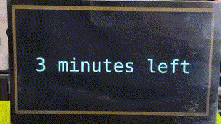

[← README](../README.md) · [Configuration](configuration.md) · 【 **Recording** 】 · [Streaming](streaming.md) · [Recordings](recordings.md) · [Architecture](architecture.md) · [Troubleshooting](troubleshooting.md) · [API](api.md) · [Diagnostics](diagnostics.md)

## Recording a Talk

### From the web UI

1. Open the **Dashboard**.
2. Verify the current talk is shown (if schedule is loaded).
3. Verify cameras and audio on the **Hardware** page - you can see live MJPEG previews of both cameras and audio level meters, all at zero CPU cost.
4. Go back to Dashboard, hit the big **Start Recording** button.


### From the physical buttons

Navigate the OLED menu to the recording option and press Select. The OLED will show recording status (elapsed time, file size) while it runs.

### What happens under the hood

The recording engine (v36) launches a single long-running FFmpeg process that:

1. Reads three video inputs simultaneously: your background PNG, the HDMI capture card, and the USB webcam.
2. Composites them into the 1920×1080 layout described above.
3. Overlays the speaker name and talk title as text.
4. Mixes audio from all detected sources (room mic + HDMI audio if available).
5. Encodes to H.264 (software, `libx264 -preset ultrafast -crf 28`) and AAC audio.
6. Writes to a **Matroska (.mkv)** container on the SSD.

MKV was chosen deliberately for crash resistance: even if power is cut mid-recording, all data up to that point is recoverable.

Output specs:

```
  Container .. MKV (Matroska)
  Video ...... H.264, Constrained Baseline, 1920x1080, 30fps, CRF 28
  Audio ...... AAC LC, 192 kbps, 48 kHz, stereo
  Bitrate .... ~2.4 Mbps total (~1 GB/hour)
  Storage .... 500GB NVMe ≈ 500 hours of recording
  Filename ... rec_YYYYMMDD_HHMMSS[_Author_Title].mkv
```

### Monitoring a recording

While recording, the dashboard shows:

- **Health histogram** - live FFmpeg stats: fps, bitrate, encoding speed, dropped frames. If speed drops below 1.0x, you have a problem.
- **Recording preview** - a ~15-second clip extracted from the growing MKV file using the "sandwich" technique, playable directly in the browser.
- **CPU and temperature charts** - 10-minute sparkline so you can spot thermal throttling.
- **Disk I/O and remaining time estimate**.

### Stopping

Hit Stop on the dashboard or press the button on the box. FFmpeg receives a clean shutdown signal, finalizes the MKV headers, and the file is ready.

### Announcements (projector messages)

During a talk, the session chair often needs to signal the speaker: "5 minutes left", "Q&A time", etc. FITEBOX can display these messages directly on the projector screen, overlaid on whatever is being shown.



From the **Dashboard**, the Announce card provides:

- A **text input** for custom messages (type anything and hit Enter or the send button).
- A **preset selector** with common messages in the language of the current talk (detected from the conference schedule). Presets include: ready to begin, time warnings (10/5/3/1 min), Q&A, and thank you.

From the **OLED**, navigate to System → Announce to select the same presets using the physical buttons.

When triggered, the message appears full-screen on the HDMI output with a **flashing yellow border** and auto-scaled white text on a dark background. The overlay lasts 10 seconds, then the display automatically returns to its previous state (recording screen, ready screen, etc.). Messages sent to the display during the overlay are queued and applied when it ends.

The web UI shows a "● LIVE" countdown badge while an announcement is active, preventing duplicate sends.

[← README](../README.md) · [Configuration](configuration.md) · 【 **Recording** 】 · [Streaming](streaming.md) · [Recordings](recordings.md) · [Architecture](architecture.md) · [Troubleshooting](troubleshooting.md) · [API](api.md) · [Diagnostics](diagnostics.md)
