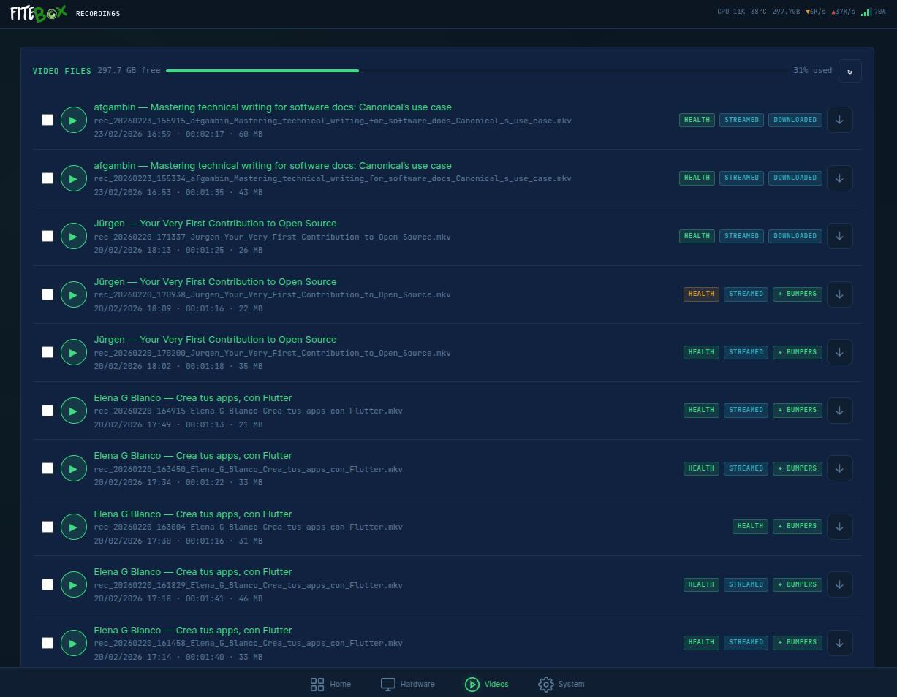

[← README](../README.md) · [Configuration](configuration.md) · [Recording](recording.md) · [Streaming](streaming.md) · 【 **Recordings** 】 · [Architecture](architecture.md) · [Troubleshooting](troubleshooting.md) · [API](api.md) · [Diagnostics](diagnostics.md)

## Managing Recordings

The **Recordings** page in the web UI lets you:

- Browse all recordings with metadata (duration, size, date, speaker, title)
- **Play back in the browser** - MKV files are remuxed to MP4 on-the-fly (zero CPU, just container repackaging)
- Download the original MKV
- **Apply bumpers** - concatenate intro + recording + outro into a single file with automatic A/V sync validation
- Batch delete with confirmation
- View JSON metadata sidecars

[← README](../README.md) · [Configuration](configuration.md) · [Recording](recording.md) · [Streaming](streaming.md) · 【 **Recordings** 】 · [Architecture](architecture.md) · [Troubleshooting](troubleshooting.md) · [API](api.md) · [Diagnostics](diagnostics.md)
